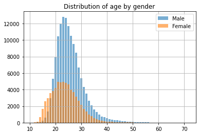
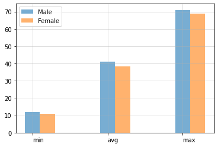
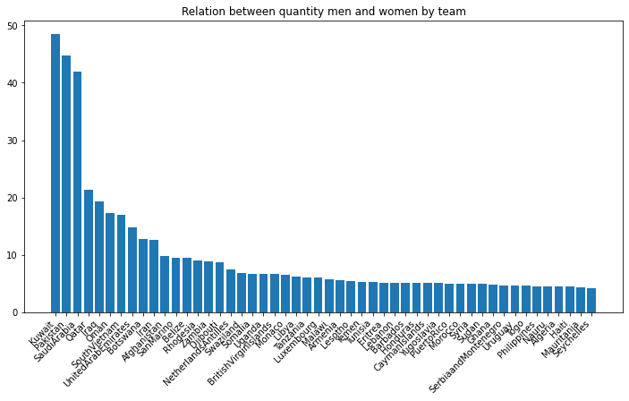
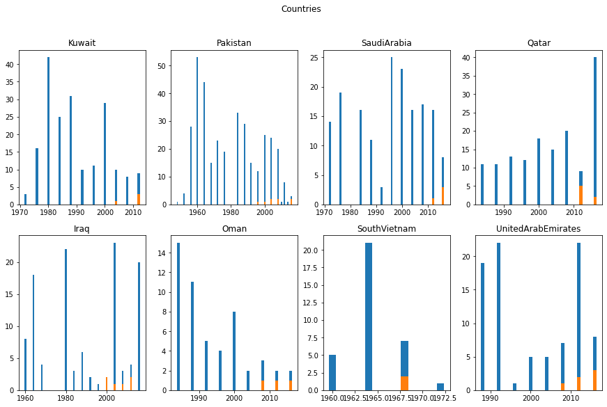
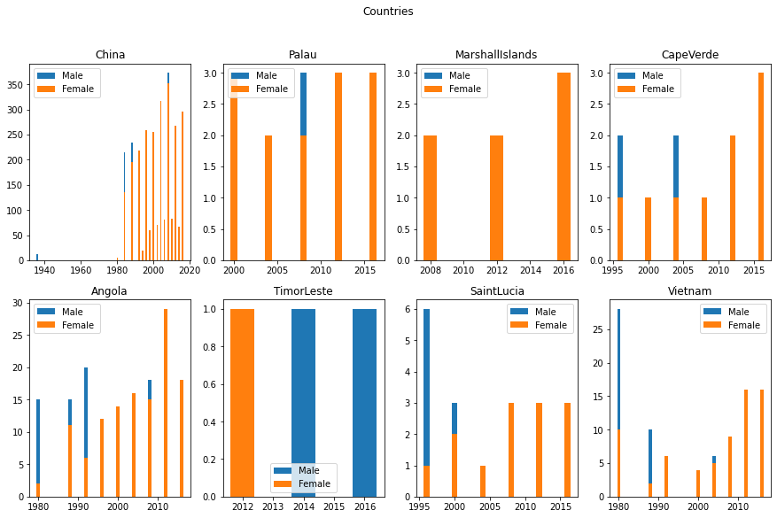
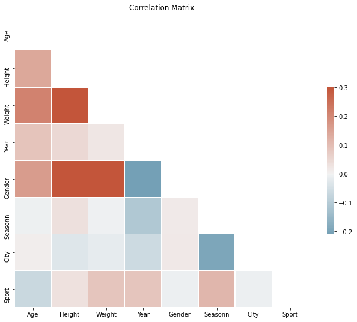

```python
import pandas as pd
from pandasql import sqldf 
import numpy as np
import matplotlib.pyplot as plt

from itertools import product
```


```python
sql = lambda q: sqldf(q, globals())
df = pd.read_csv("athlete_events.csv")

```

### Clean


```python
def clean(bbd:str,columns:list):
    qry = sql('''
    SELECT
    {1}
    FROM {0}
    '''.format(bbd,str(columns)[1:-1].replace("'" , "")))
    return qry
```

in this report, we going to explain how can to see  discrimination of gender in sports in the previous years,
To beginning, we going to exclude from the analysis the names of participants as this will be not relevant for the report, also going to make cleaning to different columns that have inconsistencies in their values, for example, the column Team has the same teams with different names.


```python
columns = 'ID','Sex','Age','Height','Weight','Team','Year','Season','City','Sport'
newdf = clean('df',columns)
newdf = newdf.dropna(subset=['Age','Height','Weight'])
newdf.Team= newdf.Team.str.replace('[\d+\W]','', regex=True)
```

we Going to make a function that separates genders in two data frames, it is to make an analysis without bias for gender. 


```python
def sex(bbd, columns:list, sex:str):
    qry = sql('''
    SELECT
    {1}
    FROM {0}
    WHERE Sex = "{2}"
    '''.format(bbd,str(columns)[1:-1].replace("'" , ""), sex))
    return qry
```


```python
Male = sex('newdf',columns,'M')
Female = sex('newdf', columns, 'F')
print(' Shape Male DataFrame {} \n Shape Female DataFrame {}'.format(Male.shape, Female.shape))
```

     Shape Male DataFrame (139454, 10) 
     Shape Female DataFrame (66711, 10)
    

In this step we did a function to count the frequency of values in different column, in the next step is possible to see, a table with frequentist of age by gender.


```python
def Count(bbd:str, column:str):
    qry= sql('''
    SELECT
    {1},
    COUNT({1}) as count
    FROM {0}
    GROUP BY {1}
    '''.format(bbd,column))
    return qry
```


```python
countageM = Count('Male','Age')
countageF = Count('Female','Age')
count = pd.concat([countageM,countageF],keys=['Male','Female']).droplevel(level=1)
count.sort_values(by='Age', ascending=False)
```


<div>
<style scoped>
    .dataframe tbody tr th:only-of-type {
        vertical-align: middle;
    }

    .dataframe tbody tr th {
        vertical-align: top;
    }

    .dataframe thead th {
        text-align: right;
    }
</style>
<table border="1" class="dataframe">
  <thead>
    <tr style="text-align: right;">
      <th></th>
      <th>Age</th>
      <th>count</th>
    </tr>
  </thead>
  <tbody>
    <tr>
      <th>Male</th>
      <td>71.0</td>
      <td>1</td>
    </tr>
    <tr>
      <th>Male</th>
      <td>70.0</td>
      <td>2</td>
    </tr>
    <tr>
      <th>Female</th>
      <td>69.0</td>
      <td>2</td>
    </tr>
    <tr>
      <th>Male</th>
      <td>68.0</td>
      <td>1</td>
    </tr>
    <tr>
      <th>Male</th>
      <td>67.0</td>
      <td>2</td>
    </tr>
    <tr>
      <th>...</th>
      <td>...</td>
      <td>...</td>
    </tr>
    <tr>
      <th>Female</th>
      <td>13.0</td>
      <td>133</td>
    </tr>
    <tr>
      <th>Male</th>
      <td>13.0</td>
      <td>28</td>
    </tr>
    <tr>
      <th>Female</th>
      <td>12.0</td>
      <td>24</td>
    </tr>
    <tr>
      <th>Male</th>
      <td>12.0</td>
      <td>3</td>
    </tr>
    <tr>
      <th>Female</th>
      <td>11.0</td>
      <td>6</td>
    </tr>
  </tbody>
</table>
<p>114 rows × 2 columns</p>
</div>


#### Distribution of age by gender.


```python
fig, ax = plt.subplots()
M = ax.bar(countageM['Age'],countageM['count'], label='Male', alpha=0.6)
F = ax.bar(countageF['Age'], countageF['count'], label='Female', alpha=0.6)
ax.legend()
plt.title('Distribution of age by gender')
plt.grid()
plt.show()
```


    

    


#### Stast 
How is the minimum age of participation in Male, what is average, how will be max? this is the same for Women, those questions will be answered in the next block with this function. 


```python
def stast(bbd:str, column, sex:str):
    qry=sql('''
    SELECT
    min({1}) as min,
    ROUND(avg({1}),2) as avg,
    max({1}) as max
    FROM {0}
    '''.format(bbd, column,sex))
    return qry
```


```python
stastM = stast('countageM','Age','Male')
stastF = stast('countageF', 'Age','Female')
summary = pd.concat([stastM,stastF],keys=['Male','Female']).droplevel(level=1)
summary
```


<div>
<style scoped>
    .dataframe tbody tr th:only-of-type {
        vertical-align: middle;
    }

    .dataframe tbody tr th {
        vertical-align: top;
    }

    .dataframe thead th {
        text-align: right;
    }
</style>
<table border="1" class="dataframe">
  <thead>
    <tr style="text-align: right;">
      <th></th>
      <th>min</th>
      <th>avg</th>
      <th>max</th>
    </tr>
  </thead>
  <tbody>
    <tr>
      <th>Male</th>
      <td>12.0</td>
      <td>41.03</td>
      <td>71.0</td>
    </tr>
    <tr>
      <th>Female</th>
      <td>11.0</td>
      <td>38.22</td>
      <td>69.0</td>
    </tr>
  </tbody>
</table>
</div>


```python
def stastplot(df:pd.DataFrame):
    
    assert type(df) == pd.DataFrame, "First parameter should be a DataFrame"
    
    x = np.arange(len(df.iloc[0].index))
    width = 0.2
    for i in range(0,len(summary),1):
        if i <= 0:
            plt.bar(x , df.iloc[i], width=0.2, label='Male',alpha=0.6)
        else:
            plt.bar(x + (width*1), df.iloc[i],width=0.2, label='Female',alpha=0.6)
    plt.xticks(x, ['min','avg','max'], horizontalalignment="left")
    plt.legend()
    plt.grid(alpha=0.5)
    plt.show()
    
```

#### Stastplot


```python
stastplot(summary)
```


    

    


#### Count Sex by Team
In this step we want to answer the question about what are the teams with more and fewer participants by gender, but for this, we can't simply compare columns, we going to create an index that will be a relation between quantity men vs women, this way we could know what are countries whit the same relative participation (values near to 0, or unequal participation (values most to 1)


```python
def team(bdd, groupby:str, orderby:str):
    qry = sql('''
    SELECT
    Team,
    Count({count}) as count
    FROM {df}
    Group by {group}
    Order by {order} desc
    '''.format(count = 'ID', df=bdd, group=groupby,order=orderby))
    return qry

```


```python
M = team('Male','Team','count')
F = team('Female','Team','count')
```


```python
def joinMF():
    qry = sql('''
    -- METRICS
    SELECT
    Team,
    Mcount,
    Fcount,
    (Mcount - Fcount) as diference,
    ROUND(CAST(Mcount as float) / CAST(Fcount as float),2)  as div
    FROM
    (-- FILL VALUE WITH 0 WHERE FCOUNT IS NAN
    SELECT
    Team,
    Mcount,
    COALESCE(Fcount,0) as Fcount
    FROM 
    ( -- JOIN TABLE M,F
    SELECT
    M.Team,
    M.count as Mcount,
    F.count as Fcount
    FROM M 
    LEFT JOIN F
    ON M.Team = F.Team))
    ''')
    return qry


```


```python
joinMF = joinMF()
joinMF = joinMF[~joinMF['div'].isnull()]
```


```python
joinMF50 = joinMF.sort_values(by='div', ascending=False).head(50)
```

Here we can see that the countries with the higher index or unequal participation by gender are countries with association cultures where women have low participation in activities.

### Plot relation between men vs women


```python
plt.figure(figsize=(12,6))
plt.bar(joinMF50['Team'],joinMF50['div'])
plt.xticks(rotation=45,horizontalalignment="right")
plt.title("Relation between quantity men and women by team")
plt.show()
```


    

    


How the participation has affected by year? is there countries with improvements in its political for partipation inclusive of all sex?


```python
teamByYear = pd.DataFrame(Male.groupby(['Team','Year']).count()['ID'])
```


```python
def teambyyear(df:str):    
    qry = sql('''
    SELECT
    Team,
    Year,
    Count('ID') as count{0}
    FROM {0}
    Group by Team,Year
    '''.format(df))
    return qry

```


```python
M = teambyyear('Male')
F = teambyyear('Female')
```


```python
testM = M[M['Team'] == 'Iran'] 
testF = F[F['Team'] == 'Iran']

```


```python
def country(country:str, team='Team'):
    Male =M[M[team] ==country]
    Fem = F[F[team] == country]
    merge = Male.merge(Fem, on='Year', how='left')
    merge = merge.fillna(0)
    merge = merge.drop(['Team_y'],axis=1)
    merge.columns = ['Country','Year','Male','Female']
    return merge
```


```python
def teambycountry(country):
    qry=sql('''
    SELECT
    Team,
    Year,
    Male,
    COALESCE(Female,0) as Female
    FROM (
    -- SELECT COLUMNS
    SELECT
    M.Team,
    M.Year,
    M.countMale as Male,
    F.countFemale as Female
    FROM
    -- JOIN M with F
    (SELECT
    *
    FROM M
    WHERE Team = "{0}") as M
    LEFT  JOIN (
    -- DATASET FEMALE
    SELECT
    *
    FROM F
    WHERE Team ="{0}") as F
    ON M.Year = F.Year)
    '''.format(country))
    return qry
```


```python
def barplot(df):
    country = teambycountry(df)
    plt.figure(figsize=(12,6))
    width = 2
    plt.bar(country.Year, country['Male'], width=width)
    plt.bar(country.Year, country['Female'],width=width)
    plt.title('{}'.format(df))
    plt.show
```


```python
countries = ['Kuwait','Pakistan','SaudiArabia','Qatar','Iraq','Oman','SouthVietnam','UnitedArabEmirates']
```


```python
fig, ax = plt.subplots(2,4, figsize=(15,9))
fig.suptitle('Countries')
for i,j in zip(countries,list(product(range(0,2,1),range(0,4,1)))):
    country= teambycountry(i)
    ax[j].bar(country.Year, country['Male'])
    ax[j].bar(country.Year, country['Female'])
    ax[j].set_title('{}'.format(i))
   

```


    

    


In the previous graph is possible to see that any countries in particular currently yet there is discrimination in the participation of women in sports, with gaps very  pronounced


```python
joinMF50 = joinMF.sort_values(by='div', ascending=True).head(50)
joinMF50.head(10)
```


<div>
<style scoped>
    .dataframe tbody tr th:only-of-type {
        vertical-align: middle;
    }

    .dataframe tbody tr th {
        vertical-align: top;
    }

    .dataframe thead th {
        text-align: right;
    }
</style>
<table border="1" class="dataframe">
  <thead>
    <tr style="text-align: right;">
      <th></th>
      <th>Team</th>
      <th>Mcount</th>
      <th>Fcount</th>
      <th>diference</th>
      <th>div</th>
    </tr>
  </thead>
  <tbody>
    <tr>
      <th>276</th>
      <td>Kosovo</td>
      <td>3</td>
      <td>5</td>
      <td>-2</td>
      <td>0.60</td>
    </tr>
    <tr>
      <th>19</th>
      <td>China</td>
      <td>2199</td>
      <td>2679</td>
      <td>-480</td>
      <td>0.82</td>
    </tr>
    <tr>
      <th>203</th>
      <td>Palau</td>
      <td>11</td>
      <td>13</td>
      <td>-2</td>
      <td>0.85</td>
    </tr>
    <tr>
      <th>220</th>
      <td>MarshallIslands</td>
      <td>6</td>
      <td>7</td>
      <td>-1</td>
      <td>0.86</td>
    </tr>
    <tr>
      <th>216</th>
      <td>CapeVerde</td>
      <td>8</td>
      <td>9</td>
      <td>-1</td>
      <td>0.89</td>
    </tr>
    <tr>
      <th>109</th>
      <td>Angola</td>
      <td>122</td>
      <td>123</td>
      <td>-1</td>
      <td>0.99</td>
    </tr>
    <tr>
      <th>244</th>
      <td>TimorLeste</td>
      <td>3</td>
      <td>3</td>
      <td>0</td>
      <td>1.00</td>
    </tr>
    <tr>
      <th>435</th>
      <td>Twinkle</td>
      <td>1</td>
      <td>1</td>
      <td>0</td>
      <td>1.00</td>
    </tr>
    <tr>
      <th>198</th>
      <td>SaintLucia</td>
      <td>14</td>
      <td>13</td>
      <td>1</td>
      <td>1.08</td>
    </tr>
    <tr>
      <th>126</th>
      <td>Vietnam</td>
      <td>77</td>
      <td>69</td>
      <td>8</td>
      <td>1.12</td>
    </tr>
  </tbody>
</table>
</div>


```python
countries = ['China','Palau','MarshallIslands','CapeVerde','Angola','TimorLeste','SaintLucia','Vietnam']
```


```python
fig, ax = plt.subplots(2,4, figsize=(15,9))
fig.suptitle('Countries')
for i,j in zip(countries,list(product(range(0,2,1),range(0,4,1)))):
    country= teambycountry(i)
    ax[j].bar(country.Year, country['Male'], label='Male')
    ax[j].bar(country.Year, country['Female'],label='Female ')
    ax[j].set_title('{}'.format(i))
    ax[j].legend()
   
```


    

    


on the other hand, also there is countries where the participation of women is more that men.

### CORRELATION 


```python
def encoding():
    df = sql('''
    SELECT
    Age,
    Height,
    Weight,
    Year,
    Season,
    City,
    Sport,
    CASE
        WHEN Sex='M' THEN 1
        ELSE 0
        END AS Gender,
    CASE
        WHEN Season='Summer' THEN 1
        ELSE 0
        END AS Seasonn
    FROM newdf''')
    return df
newdf=encoding()
```

Now we going to show the correlation between columns and to see if is possible to find any relation between columns and gender, I mean,is the year participation a deteminant for inclusion of women in sport? 


```python
from sklearn.preprocessing import OrdinalEncoder
column = newdf[['City','Sport']]
enc =  OrdinalEncoder()
epa = enc.fit_transform(column)
newdf = newdf.drop(column,axis=1).merge(pd.DataFrame(epa, columns=['City','Sport']), on=newdf.index)
newdf.head()
```


<div>
<style scoped>
    .dataframe tbody tr th:only-of-type {
        vertical-align: middle;
    }

    .dataframe tbody tr th {
        vertical-align: top;
    }

    .dataframe thead th {
        text-align: right;
    }
</style>
<table border="1" class="dataframe">
  <thead>
    <tr style="text-align: right;">
      <th></th>
      <th>key_0</th>
      <th>Age</th>
      <th>Height</th>
      <th>Weight</th>
      <th>Year</th>
      <th>Season</th>
      <th>Gender</th>
      <th>Seasonn</th>
      <th>City</th>
      <th>Sport</th>
    </tr>
  </thead>
  <tbody>
    <tr>
      <th>0</th>
      <td>0</td>
      <td>24.0</td>
      <td>180.0</td>
      <td>80.0</td>
      <td>1992</td>
      <td>Summer</td>
      <td>1</td>
      <td>1</td>
      <td>5.0</td>
      <td>6.0</td>
    </tr>
    <tr>
      <th>1</th>
      <td>1</td>
      <td>23.0</td>
      <td>170.0</td>
      <td>60.0</td>
      <td>2012</td>
      <td>Summer</td>
      <td>1</td>
      <td>1</td>
      <td>17.0</td>
      <td>26.0</td>
    </tr>
    <tr>
      <th>2</th>
      <td>2</td>
      <td>21.0</td>
      <td>185.0</td>
      <td>82.0</td>
      <td>1988</td>
      <td>Winter</td>
      <td>0</td>
      <td>0</td>
      <td>8.0</td>
      <td>43.0</td>
    </tr>
    <tr>
      <th>3</th>
      <td>3</td>
      <td>21.0</td>
      <td>185.0</td>
      <td>82.0</td>
      <td>1988</td>
      <td>Winter</td>
      <td>0</td>
      <td>0</td>
      <td>8.0</td>
      <td>43.0</td>
    </tr>
    <tr>
      <th>4</th>
      <td>4</td>
      <td>25.0</td>
      <td>185.0</td>
      <td>82.0</td>
      <td>1992</td>
      <td>Winter</td>
      <td>0</td>
      <td>0</td>
      <td>0.0</td>
      <td>43.0</td>
    </tr>
  </tbody>
</table>
</div>


```python
import seaborn as sns
def corr(df):
    corr = df.drop(['key_0','Season'],axis=1).corr()
    mask = np.triu(np.ones_like(corr, dtype=bool))
    f, ax = plt.subplots(figsize=(11, 9))
    cmap = sns.diverging_palette(230, 20, as_cmap=True)
    sns.heatmap(corr, mask=mask, cmap=cmap, vmax=.3, center=0,
            square=True, linewidths=.5, cbar_kws={"shrink": .5})
    plt.title('Correlation Matrix')
    plt.show()
```

In the next graph is possible to see that if there is a mild relation between year and its influence on Gender, but this is not sufficient to explain discrimination for women in sports.


```python
corr(newdf)
```


    

    

